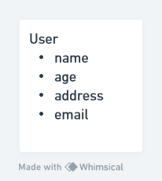
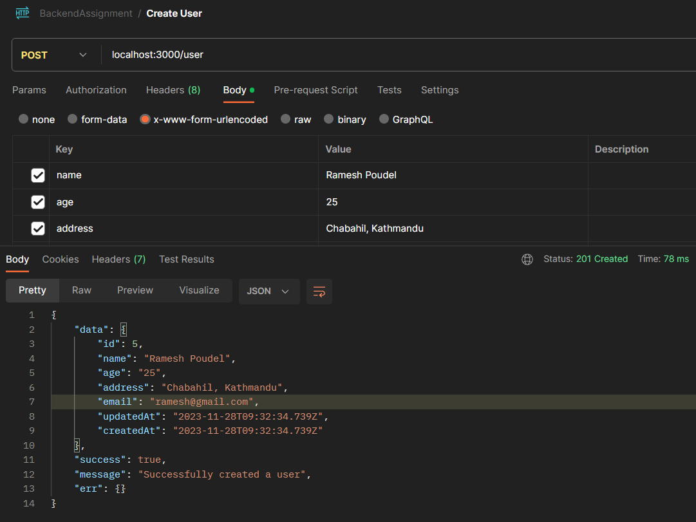
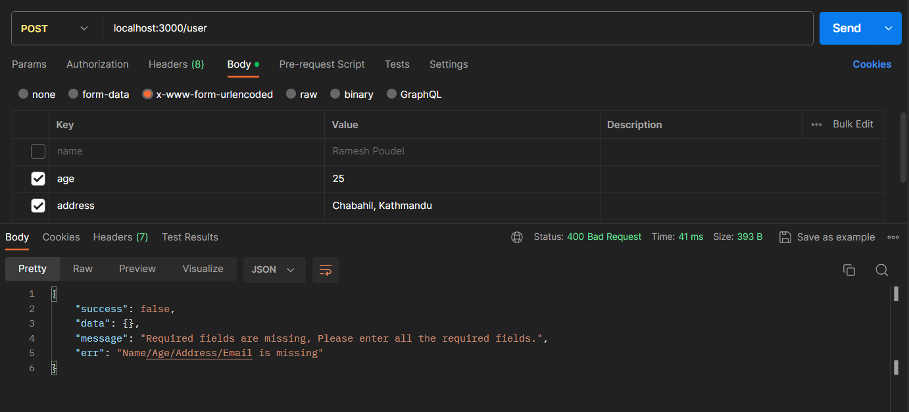
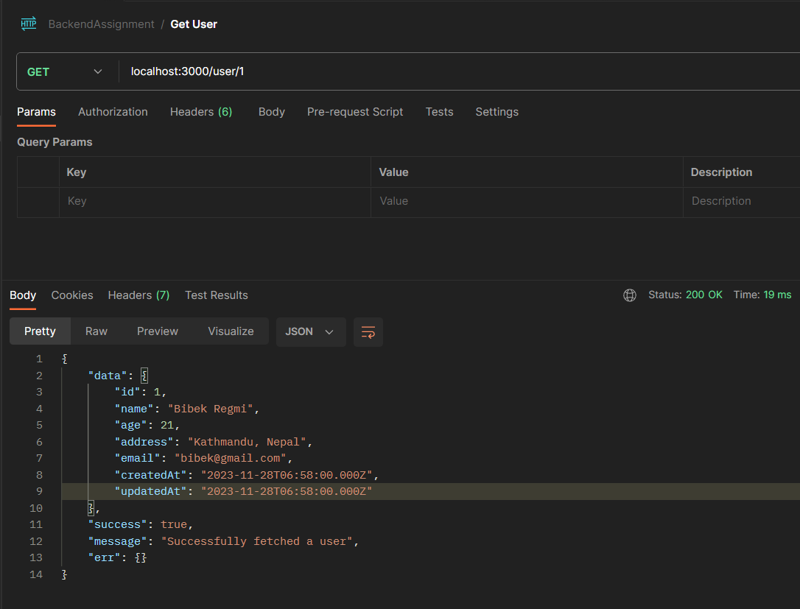
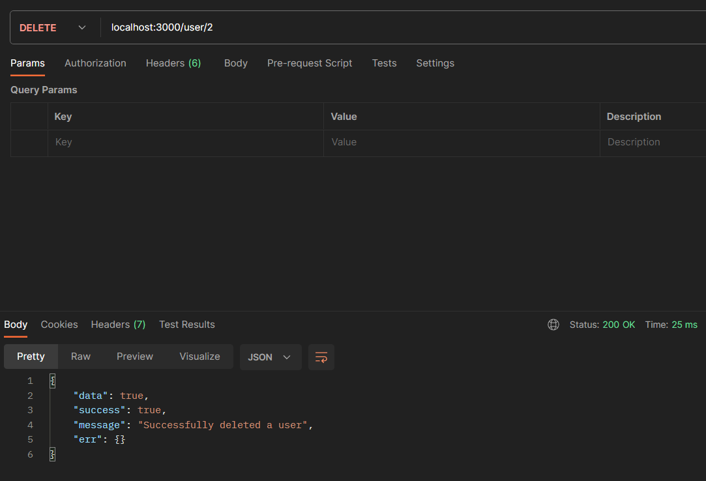
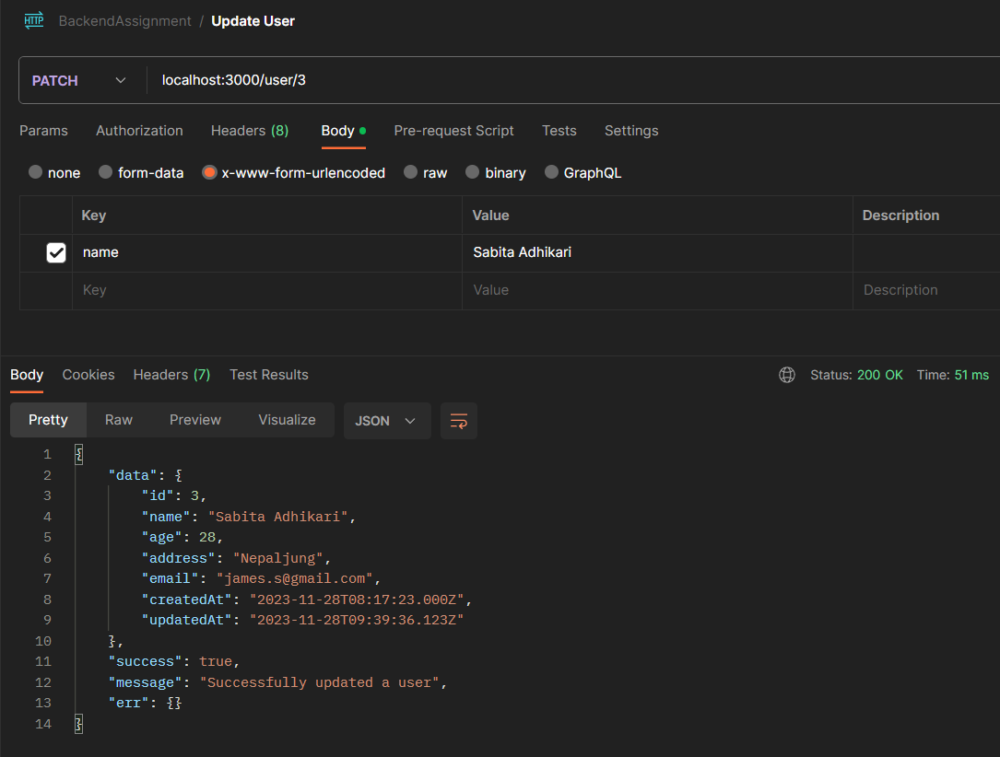

# A Simple CRUD Application
*Read this README file carefully*

## Database 

- User
    - name
    - age
    - address
    - email

## Used technologies
- Express
- Nodemon(to restart server)
- Dotenv
- Body Parser
- Sequelize(ORM)
- Sequelize-cli
- Mysql2

## Api Documentation
[API DOCUMENTATION POSTMAN](https://documenter.getpostman.com/view/20581499/2s9YeEdsg3)

## Setup and run
- Clone the project `` in your local machine.
- Run `npm install` inside the project root directory.
- Create a `.env` file and add `PORT=3000` if not already exists.
- Inside the `src/config` folder edit file `config.json` and then add your Mysql Database `name` and `password`. 
- Once you've added your db config as listed above, go to the src folder from your terminal and execute `npx sequelize db:create`. It will create the database in your system.
- Then migrate the model, by executing the  command `npx sequelize db:migrate`
- Finally you can start CRUD operation in your `localhost`.
- You can see `API DOCS` for guidance [Api Doc](https://documenter.getpostman.com/view/20581499/2s9YeEdsg3)

## Screenshots

# Create User

# Validation 

# Get User

# Delete User

# Update User
